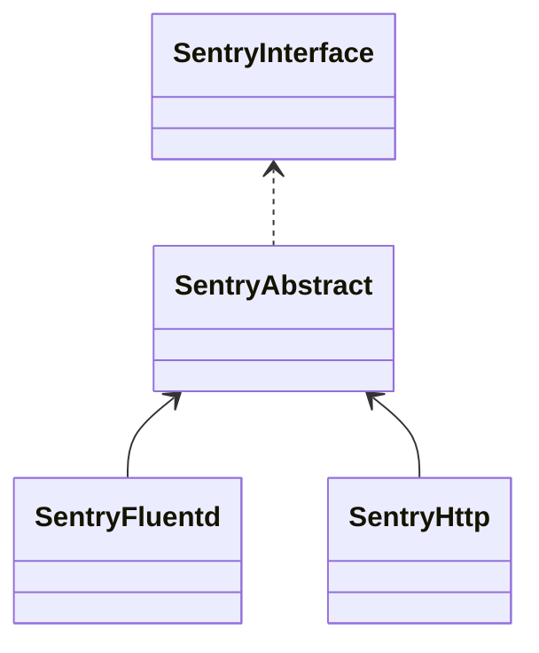

# Объектная реализация Sentry клиента

Поддерживает:
* установку тегов
* установку пользователя/клиента затронутого проблемой
* добавление `breadcrumbs` - событий, которые привели к проблеме
* захват и передачу в _Sentry_ исключения или сообщения
* включение/отключение автоматичекой обработки ошибок
* 2 способа транспортировки:
 * `SentryHttp` - транспортировка через `http`
 * `SentryFluentd` - транспортировка через `fluentd`/`td-agent`

> Несмотря на объектный подход, инициализация нескольких одновременных `Sentry клиентов` недопустима.

Диаграмма классов `клиентов Sentry`:


## Транспортировка событий в Sentry

Поддерживаться 2 вида транспортировки событий:
* через `HTTP` - стандартный способ (поддерживается из коробки [sentry/sdk](https://packagist.org/packages/sentry/sdk))
```bash
use Leads\Sentry\Implementations\SentryHttp;
use Leads\Sentry\Entities\IntegrationsOptions;

$dsn = '';
$environment = 'production';
$release = 'my-project@1.0.0';

$sentryClient = new SentryHttp(
    $dsn,
    new IntegrationsOptions(),
    $environment,
    $release,
);
```

* через [fluentd/td-agent](https://docs.fluentd.org/) - реализован через пакет [fluent/logger](https://packagist.org/packages/fluent/logger) в данном проекте как более быстрое для клиентского кода и более устойчивое для сервера `Sentry` в одном инстансе
```bash
use Fluent\Logger\FluentLogger;
use Leads\Sentry\Implementations\SentryHttp;
use Leads\Sentry\Entities\IntegrationsOptions;

$dsn = '';
$environment = 'production';
$release = 'my-project@1.0.0';
$fluentHost = 'unix:///var/run/td-agent/fluentd.sock';
$fluentPort = '24224';

$sentryClient = new SentryFluentd(
    $dsn,
    new IntegrationsOptions(),
    new FluentLogger($fluentHost, $fluentPort),
    $environment,
    $release
);
```

Реализация _Sentry_ клиента `SentryFluentd` отправляет `fluentd` запись с тегом `sentry.store.{project_id}.{sentry_key}` где:
* `project_id` - идентификатор проекта в _Sentry_
* `sentry_key` - авторизационный ключ (часть `DSN`)

Узел `fluentd`, который осуществляет отправку события в _Sentry_ должен использовать [store endpoint](https://develop.sentry.dev/sdk/store/), например так (`localhost:9000` - адрес сервера _Sentry_):
```
<match sentry.store.**>
  @type http
  @log_level debug
  
  endpoint http://localhost:9000/api/${tag[2]}/${tag[1]}/?sentry_version=7&sentry_client=td-agent&sentry_key=${tag[3]}
  open_timeout 2
  http_method post
  content_type application/json

  <buffer tag>
    @type file
    path /var/log/td-agent/sentry.store.buffer
    retry_forever true
    flush_mode immediate
    chunk_limit_size 32MB
    retry_type periodic
    retry_wait 10s
    retry_randomize true
    compress text
  </buffer>
</match>
```

> Для `fluentd` `>=1.12.1` можно использовать авторизацию через [заголовки запроса](https://docs.fluentd.org/output/http#headers_from_placeholders).


## Способы обработки ошибок

Так как этот код оборачивает [sentry/sdk](https://packagist.org/packages/sentry/sdk), то ему также присущи 2 способа обработки ошибок:
* автоматически при помощи [обработчиков ошибок](https://github.com/getsentry/sentry-php/blob/master/src/ErrorHandler.php), реализованных [интеграциями](https://docs.sentry.io/platforms/php/integrations/)
* вручную, например в блоке `catch`:
```php
try {
  //...
} catch (\Throwable $e) {
  $sentryClient->captureException($e);
}
```

Включение или отключение производится через объект класса [IntegrationsOptions](/src/Entities/IntegrationsOptions.php) при иницилазиции `Sentry клиента`:
```bash
use Leads\Sentry\Implementations\SentryHttp;
use Leads\Sentry\Entities\IntegrationsOptions;

$dsn = '';
$environment = 'production';
$release = 'my-project@1.0.0';

$intOptions = new IntegrationsOptions();
$intOptions->setAutoHandler(true);

$sentryClient = new SentryHttp(
    $dsn,
    new IntegrationsOptions(),
    $environment,
    $release,
);
```

> При автоматической обработке ошибок средствами `Sentry клиента` необходимо инициализировать этого клиента как можно раньше в коде приложения!


## Дополнительные функции

Установить [тег](https://docs.sentry.io/platforms/php/enriching-events/tags/):
```php
$sentryClient->setTag('tagName', 'tagValue');
```

Отправить [сообщение](https://docs.sentry.io/platforms/php/usage/set-level/):
```php
$sentryClient->captureMessage('', Leads\Sentry\Entities\SeverityLevel::ERROR);
```

Установить [пользователя](https://docs.sentry.io/platforms/php/enriching-events/identify-user/) получившего ошибку:
```php
use Leads\Sentry\Entities\User;

$userId = 4687;
$userName = 'username';
$sentryClient->setUser(
    new User($id, $name)
);
```

Установить [хлебные крошки](https://docs.sentry.io/platforms/php/enriching-events/breadcrumbs/):
```php
use Leads\Sentry\Entities\Breadcrumb;
use Leads\Sentry\Entities\SeverityLevel;

$metadata = [
    'key' => 'value',
];

$sentryClient->addBreadcrumb(
    new Breadcrumb(
        SeverityLevel::INFO,
        'category',
        'message',
        $metadata
    )
);
```
